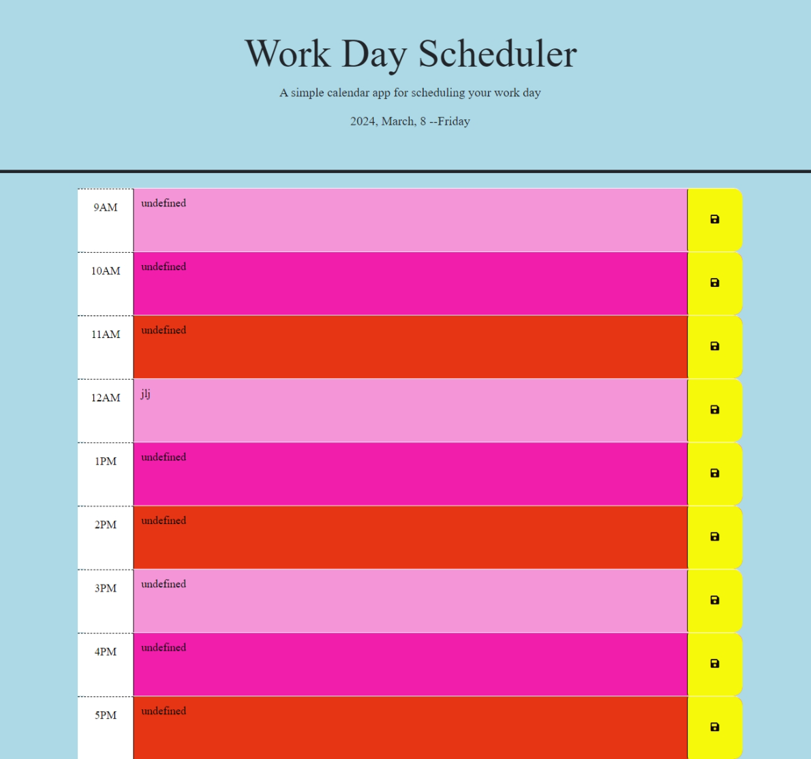

# workDaySchedule
Work Day Schedule for the user to enter information in each hour time slot. The time slots are from the hours of 9 to 5pm. The information can be saved and stored in the local storage. A notification will let the user know if saved. 

file:///C:/Users/RoxK3/OneDrive/Desktop/workDaySchedule/Develop/index.html

https://github.com/RoxD90/workDaySchedule

